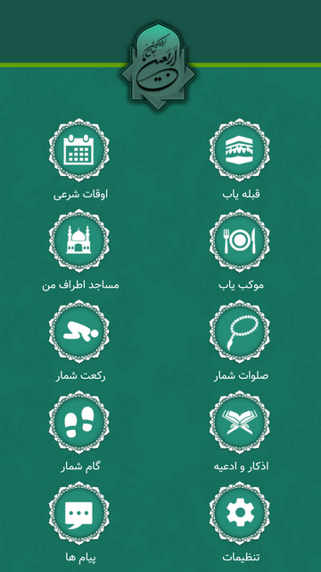
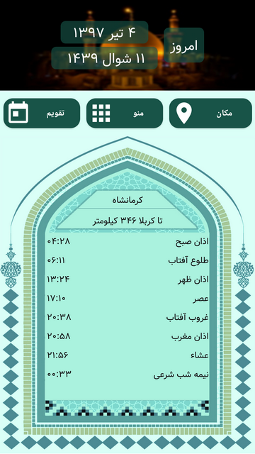
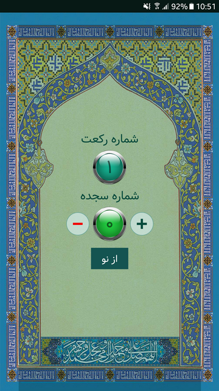
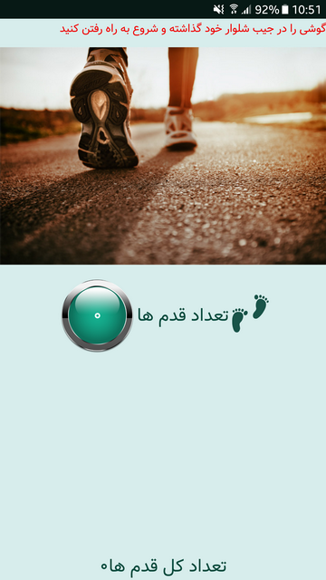

# Arbaeen
Arbaeen is a full feature app for those how want to have a trip to IRAQ to visit religious places, some of the features are:
1. Today’s calendar with Salat times
2. Gheble finder
3. Mosques near me (this feature is not working any longer because google maps is no free anymore and I don’t have a billing account, so if you have you know what to do…)
4. Mokeb finder
5. Rekat counter (with proximity sensor)
6. Salavat counter
7. Pedometer
8. Azan
9. Prays
10. Firebase based cloud messaging
So if you are interested in this app and want to collaborate you if you have any questions feel free to ask me anything. This app is in Persian so one of the things that you can do is translate it.

  
  
  
  

اربعین برنامه مذهبی مخصوص کسانی است که قصد سفر به عراق را دارند. این برنامه دارای امکانات زیر می باشد:
 
1. تقویم امروز و اوقات شرعی
 
2. قبله یاب
 
3. مساجد اطراف من
 
4. موکب یاب
 
5. رکعت شمار ( با استفاده از سنسور مجاورت)
 
6. صلوات شمار
 
7. قدم شمار
 
8. اذان
 
9. دعاهای و ذکر های روزانه
 
10. دریافت پیام از طریق وب
 
اگر مایل به همکاری یا گسترش پروژه یا هر سوالی داشتید با هم در تماس باشید.
 

# License
   Copyright 2018 Shahab Azimi

   Licensed under the Apache License, Version 2.0 (the "License");
   you may not use this file except in compliance with the License.
   You may obtain a copy of the License at

       http://www.apache.org/licenses/LICENSE-2.0

   Unless required by applicable law or agreed to in writing, software
   distributed under the License is distributed on an "AS IS" BASIS,
   WITHOUT WARRANTIES OR CONDITIONS OF ANY KIND, either express or implied.
   See the License for the specific language governing permissions and
   limitations under the License.

